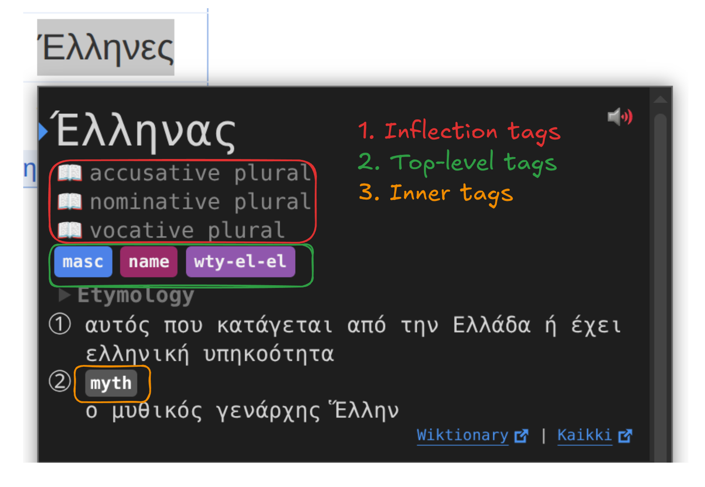

The mental model for tag extraction is as follows:
```
Wiktionary
  │
  │ (wiktextract)
  │
  ├─>   raw_tags
  │     ↓      ↓
  └─> tags / topics
        ↓
   tag processing (which tags to keep, their short forms etc.)
        ↓
   tag sorting (only for inflection tags)
        ↓
   tag formatting (global css)
        ↓
   (optional, custom css in yomitan)
        ↓
   shown tag in yomitan
```

---

## Overview

[Wiktextract](https://github.com/tatuylonen/wiktextract) extracts three _types_ of tags:

1. `raw_tags`: original language tags as they appear on Wiktionary (e.g. αρσενικό)
2. `tags`: normalized, English-translated tags (e.g. masculine)
3. `topics`: normalized, English-translated tags (e.g. Music), concerning general activities.

`raw_tags` are converted to `tags` and `topics` by wiktextract. We don't use the `raw_tags` directly, because they basically can be anything, including wiktionary editors mistakes. Working only with `tags` is the more reliable choice.

Wiktextract `tags` and `topics` can end up in multiple parts of a main dictionary entry:

<div align="center">
  
</div>

Even though `topics` happen almost exclusively as inner tags, a wiktextract tag can be used as any of the three.

### CSS

TODO: should this be in the css page?

Here is a basic example on how to handle these tags with your custom css.

```css
/* Hide inflections (~book icon, inflection tags) */
.inflection-rule-chains { display: none !important; }

/* Hide dictionary name (top-level tag) */
[data-category="dictionary"] { display: none !important; }
/* Hide gender tags (top-level tag) */
[data-category="gender"] { display: none !important; }

/* Hide inner topic tags (note the -sc-) */
[data-sc-category="topic"] { display: none !important; }
```

---

## Tag order

In the main dictionary, tag order depends on its type:

1. **Inflection tags**: we sort them ourselves when building the dictionary, using `assets/tag_order.json`. While this file has categories (formatility, cases etc.), those are later strip and serve only as visual help. The sorting is done with the flattened list.
Tag postprocessing is only done for _forms_ after building the whole intermediate representation, to only sort once with every extracted tag. The relevant function is `src/dict/main.rs::postprocess_forms`.
They appear in the order they are in the dictionary.
2. **Top-level tags**: are sorted by yomitan based on `sortingOrder` (see below) of the `tag_bank_term_1.json` shipped with the dictionary. The relevant yomitan code can be found [here](https://github.com/yomidevs/yomitan/blob/e03bae777aa161783ce00128cdc81de221fda56f/ext/js/language/translator.js#L1124). They may **NOT** appear in the order they are in the dictionary.
3. **Inner tags**: we sort them ourselves when building the dictionary based on `sortingOrder`. They appear in the order they are in the dictionary.

## Tag processing

Tag processing is ruled by `tag_bank_term` files. Currently, there are two: `assets/tag_bank_term.json` and `assets/tag_bank_term_variety.json`, separated only for visibility, but later merged via the build script in `tag_constants.rs`. The items of this JSON list are a custom version of:

```typescript
type TagInformation = [
  tagName: string,
  category: string,
  sortingOrder: number,
  notes: string,
  popularityScore: number,
];
```

where `notes` is replaced with either a string, or a list of strings representing aliases, the **first** one being shown when hovering the tag.

For example, this tag information:

```json
[
    "abbv",
    "",
    0,
    [
        "abbreviation",
        "abbrev"
    ],
    0
]
```

will convert both the wiktextract tags `abbreviation` and `abbrev` into `abbv`, and show `abbreviation` when hovered in yomitan.

Here is an example of a simple [commit](https://github.com/yomidevs/wiktionary-to-yomitan/commit/00c69daa89344d971978d905897aa19e7c1ae619) to add the "Buddhism" tag, that modifies the JSON, then runs the build script to update the rust code. Other example adding multiple tags [here](https://github.com/yomidevs/wiktionary-to-yomitan/commit/0b8013b0fe01f17a543a840200733a431bc1187b).

!!! warning "Run the build script after any modification to update the rust code: either `just build` or `python3 scripts/build.py`"

## Debugging

These are some steps to debug why a Wiktionary tag may not appear in yomitan:

1. **Is the Wiktionary tag really a tag?** Sometimes badly formatted text, or a wrong template may **look** like a tag but it is not.
2. **Is the Wiktionary tag being extracted by wiktextract?** Check the Kaikki link on the popup bottom-right to confirm.
3. **Is the Wiktionary tag being extracted as a `raw_tag`?** If it doesn't, see this [issue](https://github.com/yomidevs/wiktionary-to-yomitan/issues/84), and the associated [PR](https://github.com/tatuylonen/wiktextract/pull/997) in wiktextract to have a grasp on how to request/add translations.
4. **The tag is in wiktextract, but not in the dictionary?** Check if the tag is whitelisted in any `tag_bank_term` file.
5. **The tag is whitelisted, but not in the dictionary?** Finally our problem, please open an [issue](https://github.com/yomidevs/wiktionary-to-yomitan/issues/new).

## Localization

To add or update tag localization for a language, create a file named `tags_{iso}.json` in the appropriate directory (e.g. `assets/tags/locale/tags_ja.json` for Japanese).

The file maps English canonical tag names to their localized equivalents:
```json
{
    "noun": ["名", "名詞"],
    "verb": ["動", "動詞"],
    "transitive verb": ["他動", "他動詞"]
}
```

Each entry is a pair of `[short, long]` forms, where `short` is shown in the dictionary and `long` is shown on hover.

The key must match the 4th field of the corresponding entry in `assets/tag_bank_term.json`.
When that field is a string, use it directly. When it is an array, use the **first** element (the primary alias):
```json
["v", "partOfSpeech", -1, "verb", 1]
→ key is "verb"

["vt", "partOfSpeech", -1, ["transitive verb", "transitive"], 1]
→ key is "transitive verb", not "transitive"
```

!!! warning "Run the build script after any modification to update the rust code: either `just build` or `python3 scripts/build.py`"

Localization is automatically applied to every dictionary that uses that language as its target.
You do not need to localize every tag: any tag without a localization entry will fall back to English.

### Tips

On how to write a `tags_{iso}.json` localization file.

* Start with a simple subset. If you are familiar with the dictionary, localize the most common tags first. You can also localize a common category like `partOfSpech`
* (_For finding the English long tag_) Be familiar with long tag forms of `assets/tag_bank_term.json`. Reminder that you only need to localize the first element. If the tag is not yet localized, the English long tag is displayed on hovering a tag.
* (_For finding the localized long tag_) You can check what wiktextract does when translating `raw_tags` to `tags`/`topics` and do the inverse. For instance, this is the relevant file for [Japanese](https://github.com/tatuylonen/wiktextract/blob/master/src/wiktextract/extractor/ja/tags.py), and this one for [Greek](https://github.com/tatuylonen/wiktextract/blob/master/src/wiktextract/extractor/el/tags.py). To chose between aliases that get normalized in wiktextract, consulting Wiktionary can be a solution, but ultimately is a matter of personal taste.
* (_For Japanese_) Because of the Japanese-focused roots of yomitan, one can take inspiration of the [official JMDict page](https://www.edrdg.org/jmwsgi/edhelp.py?svc=jmdict&sid=#kw_pos) (found in the yomitan [wiki](https://github.com/yomidevs/yomitan/blob/master/docs/making-yomitan-dictionaries.md))
* (_For finding the localized short tag_) One can take inspiration, among other places, from [wordreference](https://www.wordreference.com/english/abbreviationsWRD.aspx?dict=gren).
